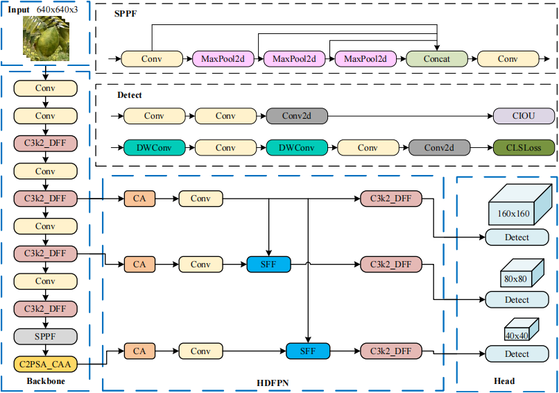

# DCH-YOLO11

DCH-YOLO11 is an enhanced object detection model based on YOLO11, specifically designed for accurate recognition of multi-symptom citrus Huanglongbing (HLB) leaves under complex field conditions. This project introduces three innovative modules to improve the original YOLO11 architecture, boosting feature extraction, fine-grained recognition, and generalization across challenging scenarios.

## Key Features

- **Three Innovative Modules:**
  - `C3k2_DFF` (Dynamic Feature Fusion): Strengthens interaction between global and local features for better detection of subtle early-stage symptoms.
  - `C2PSA_CAA` (Context Anchor Attention): Focuses on complex leaf vein regions and enhances the model’s ability to distinguish diverse symptoms.
  - `HDFPN` (High-Efficiency Dynamic Feature Pyramid Network): Optimizes multi-scale feature fusion for robust detection across object sizes.
- **Full Integration**
  - All three modules have been fully integrated into the YOLO pipeline.
  - The core implementation of these modules is located in `ultralytics/nn/Addmodules/`.
  - All new modules are seamlessly fused into the YOLO detection workflow in `ultralytics/nn/tasks.py`.
- **Model Architecture**
  
- **Dependencies**
  All required packages are listed in `requirements.txt` for easy setup.

## Public Dataset

For full reproducibility, this project supports direct use of the public citrus HLB dataset:  
[https://doi.org/10.57760/sciencedb.j00001.00947](https://doi.org/10.57760/sciencedb.j00001.00947)

> **Note:**  
> The dataset is not included in this repository due to copyright and data policy compliance. Please download the dataset from the official website above.

## Quick Start

1. **Clone the repository**
    ```bash
    git clone https://github.com/CdW8/DCH-YOLO11.git
    cd DCH-YOLO11
    ```

2. **Install dependencies**
    ```bash
    pip install -r requirements.txt
    ```

3. **Prepare the dataset**
    - Download the public citrus HLB dataset ([link](https://doi.org/10.57760/sciencedb.j00001.00947)).
    - Configure the dataset path in the project as described in this README.

4. **Training & Inference**
    - All training and inference code is located in the `ultralytics` directory.
    - The three novel modules are already integrated in `ultralytics/nn/tasks.py`.
    - After configuring the dataset, simply follow the usage instructions in this README to run training or inference and reproduce the main results.

## Application Scenarios

- Multi-symptom HLB leaf detection
- Plant disease identification in complex field environments
- Other fine-grained object detection tasks

## Citation

If you find this project useful, please consider citing or starring the repository!